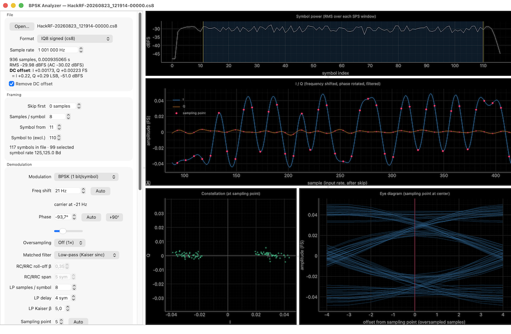
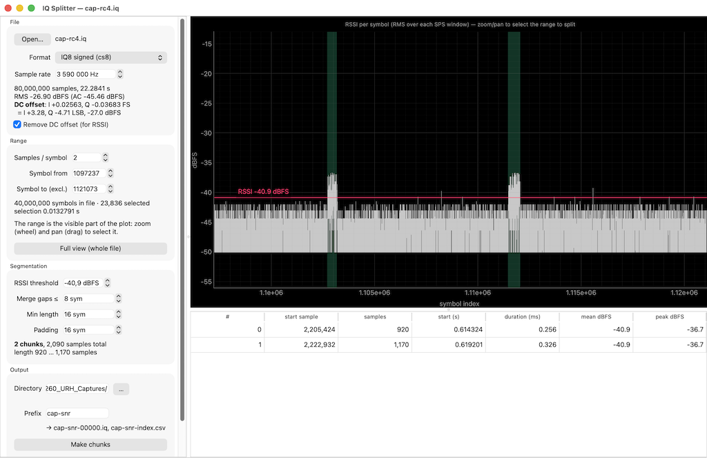
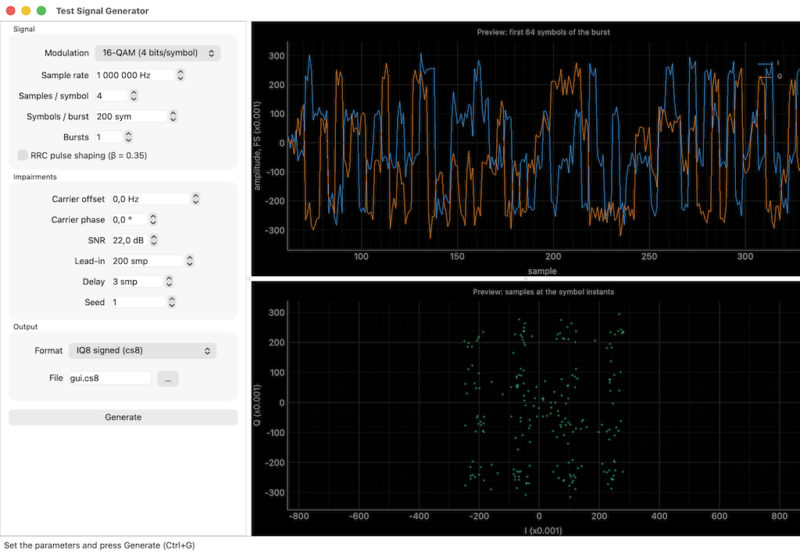

# Demod Analyzer

Interactive analysis/demodulation of digital signals (BPSK, QPSK, 16-QAM). Built to help [openstint](https://github.com/zsellera/openstint) development. Transponder test captures at `recordings/`.



## Setup / run

```sh
python3 -m venv .venv
.venv/bin/pip install -r requirements.txt
.venv/bin/python demod_analyzer.py [capture.cs8]
```

Try it on a synthetic signal:

```sh
.venv/bin/python make_test_signal.py test.cs8 --format int8     # rectangular pulses
.venv/bin/python make_test_signal.py test.cs16 --format int16 --rrc
.venv/bin/python make_test_signal.py qam.cs16 --format int16 --rrc --mod qam16
.venv/bin/python demod_analyzer.py test.cs8                      # fs=1 MHz, skip 5000, SPS 8
```

`--mod bpsk|qpsk|qam16` picks the constellation (default `bpsk`). Run
`make_test_signal.py` without arguments for a GUI with a live preview of the
signal it is about to write.

## Auxiliary tools

### IQ splitter

Segment an IQ recording into smaller chunks based on RSSI



### Test signal generator

Generate test data; available in command line as well (see above)



## License

Copyright (C) 2026 Attila Zseller

Licensed under the GNU General Public License v3.0 or later; see
[LICENSE](LICENSE) for the full text. This program is distributed in the hope
that it will be useful, but WITHOUT ANY WARRANTY; without even the implied
warranty of MERCHANTABILITY or FITNESS FOR A PARTICULAR PURPOSE.
